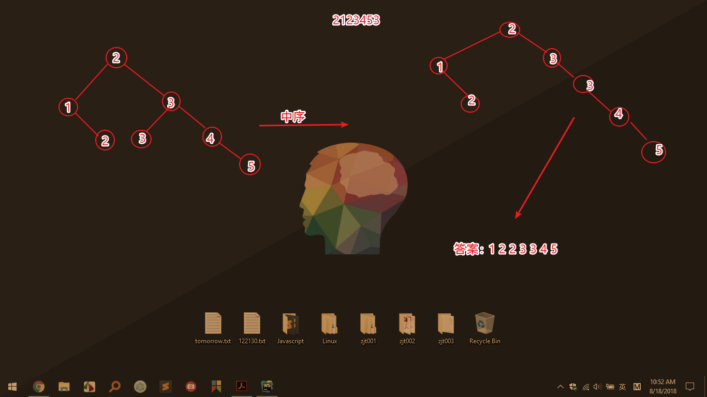
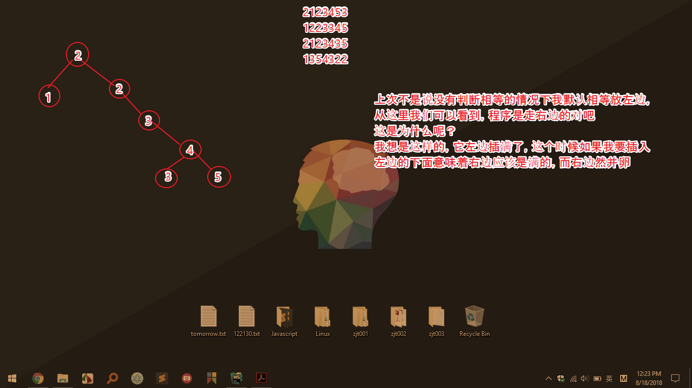
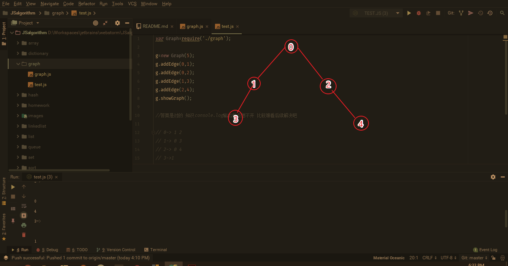

# Algorithm in Javascript

#### Javascript玄学，一切皆对象，处处是对象，到处是回调 233333

>阿涛在努力，前端说白了就是Javascript，不要怂，就是刚，Javascript语言的数据结构和算法 从现在开始！

## 一、关于排序算法 （这个先拿来练练手，不是按书的顺序的）

  **1.1） 冒泡排序：** 复杂度为O(n^2),简单地说下思路就是用for循环比较 前者比后者大 换下位置。

  **1.2） 选择排序：** 复杂度为O(n^2)，原址比较排序算法，找到数构最小值放第一，第二小放第二，就是这样。

  **总结：** 这两个活宝排序算法还是比较像的，一个冒泡越往右泡越大，一个往左先确定最小的，再第二小。

  **1.3） 插入排序：** 复杂度为O(n^2),算法是从第二个位置开始的，与前面的比较，比它小的插入前面，这个有点抽象，举个例子
  假定arr1的数组为[3,,5,1,4,2],首先我们知道3已经默认排好了，然后我们3和5比，顺序对的就不动，然后1和5比，插上去，再和3比插上去，目前应该是1，3，5.
  然后4跟5比插上去，跟3比不插，现在是1，3，4，5，然后2跟5比插上去跟4比插上去3比插上去跟1比不用插，至此1，2，3，4，5 排序完成。

  **1.4）归并排序:thumbsup:：** 复杂度为O(nlog^n)，相比前三个这个要好很多啊，它其实是一种分支算法，把一个原始数组劈开拆分成较小数组进行比较，将结果插入到新的结果集数组
  中去，由于是分治算法，所有它是递归的。我还是举个例子吧，比如[3,4,1,2]这个数组，一刀劈开分成[3,4]和[1,2]这两个，然后3和1比把1插入结果集[1],继续比4和2把2插入
  结果集[1,2],然后比完这一趟，把[3,4]劈开，进行比较，[1,2,3,4]出来了走你！

  **1.5）基数排序:** 这个是在学队列的时候，比方说用一个随机数构造两位数10个，然后呢 ，按个位数一次进出队列，按十位数一次进出队列，然后答案很明了了。

## 二、数组
对于数组的定义一般是一个存储元素的线性集合，但是Javascript数组6啊，我们不一样，
它准确的来说是一种对象（Object）,偏移量的索引代表它的属性，数字索引在内部会被转换为
字符串，因此JavaScript对象的属性名必须是字符串，因为人家是个对象，所有效率比其他语言差点

**简单粗暴的创建数组方式**

var arr=[];     //数组length=0

**稍微温柔点**

var arr=[1,9,9,7,0,6,1,3]   //长度是8，数字是我的生日

**搞对象方式创建**

var arr=new Array();        //对象嘛，没啥好解释的

**温柔地搞对象创建**

var arr=new Array(1,9,9,7,0,6,1,3)      //构造函数传参

_Javascript作为脚本之王，有一点很秀的是，它这个数组里的值不一定是同类型的_

**关于数组对象的属性**

length:长度(JS中数组的长度可以任意增长，秀不秀，length只是当前长度，用于遍历数组)

**关于数组的方法**

isArray(arr):判断是不是数组

push()/unshift():添加元素(可变函数)，push()在最后添加，unshift()在最前面添加

pop()/shift():从数组末尾删除元素/从数组开头删

(last)indexOf():查传进来的参数在目标中是否存在（存取函数），正确返回索引，错误-1
index是第一个，带last的是最后一个，就是一个从左往右读，一个从右往左读，但是索引都是从左往右的

join()/toString():转成字符串,join（）括号可带东西功能略强大

reverse()/sort()(可变函数):前者是将元素的顺序翻转，后者则是字典排序并非按大小的，比方说你可以试下1 100 2 3 4，结果100并不是最后，这里改进它用大小比较的方法是传入一个比较函数把它作为参数，让它不按字典排序

**那些转数组的方法**

String转数组：split()       //框号里面可以写分隔符

arr1.concat(arr2):合并多个数组到一个数组

arr.splice(index,length):截取数组某个子集到一个数组,起始索引(从0开始，从索引处开始删)，长度，截取后源数组被截取的就没了啊，如果长度为0，然后你再添加个参数就是插入元素了,这个也是可变函数


**关于数组赋值给其他数组**

**浅复制**

给赋值的数组增加引用，但修改引用数组，赋值数组会一起变化

**深复制**

给赋值的数组增加引用，但修改引用数组，赋值数组不会变化

**可变函数：** JavaScript中可以不必引用数组中的某个元素，就能改变数组的内容的函数

**不生成新数组的迭代器方法：** foreach()、every()、some()、reduce()和reduceRight()函数 ,其中foreach()接收一个函数作为参数，every和some接收一个返回值为Boolean类型的函数，前者所有的为true才是true，后者只要满足一个true就是true
reduce()函数的话用于累加值计算，如果是数字返回累加结果，如果是字符串返回 字符串句子,reduceRight()就是从右边开始

**生成新数组的迭代器方法：** filter()和map(),map()和foreach()类似但是会产生新数组，filter()和every()类似，但是所有为true就会产生一个新数组，这个真的很有用

**二位数组：** Javascript只支持一维数组，但是我们可以嵌套进去一维数组，这样就形成了二维数组

**二维数组操作：** 这里我们知道二维应该时一个平面，那么它就有两条基准线，x和y分别对应横纵坐标，一组嵌入式的for循环，如果时按列访问，那么最外面一层时行，最里面时列，反正亦然，
说到这个二维，有的时候哪有凑的那么好方方正正，可能每个维度的长度不一样，但是你会发现Javascript处理起来的效果还是令人满意的

**对象数组：** 就是数组里有对象哇,我们知道创建对象可以有工厂方法，构造函数传参，原型链等，昨天晚上很晚了用构造函数传参发现一直是undefined，真让人头大，分析
了下思路又是对的，真的是不解，今天在构造函数里写了两个获取x和y的方法，让人头大的是又来了，答案是很明朗了，可是为什么会有第三个参数NaN就有点迷，最后脑子还是多转了一圈
为什么它获取的是undefined，也就是它拿不到创建的对象的参数的值喽，真相就是----答案只有一个 没用返回this指针，最后终于解决了这个问题，开心!

## 三、列表（顺序表）
定义：一组有序数据，在Javascript中列表数据类型可不相同，在Javascript中列表数据类型可不相同，在Javascript中列表数据类型可不相同，
重要的事情说三遍，元素个数没有限定，但内存是有限的，应用场景是数据结构不复杂然后数据量不大，那，就是它啦。

列表的抽象数据类型（ADT）定义如下：


| 属性和方法    | 含义解释                        |
| :----------: | :---------------------------: |
| listSize     | 列表的元素个数                  |
| pos          | 列表的当前位置                  |
| length()     | 返回列表中元素个数               |
| clear()      | 清空列表中所有元素               |
| toString()   | 返回列表的字符串形式             |
| getElement() | 返回当前位置的元素               |
| insert()     | 在现有元素后插入新元素            |
| append()     | 在列表的末尾插入新元素            |
| remove()     | 从列表中删除元素                 |
| front()      | 将列表的当前位置移动到第一个元素   |
| end()        | 将列表的当前位置移动到最后一个元素 |
| pre()        | 将当前位置前移一位               |
| next()       | 将当前位置后移一位               |
| currPos()    | 返回列表的当前位置               |
| moveTo(n)    | 将当前位置移动到指定位置          |


**注意：** 在使用迭代器遍历，由于数组的长度是可变的，所有会进入一个死循环请加点判断让他停下来

```$xslt
for(list.front();list.currPos()<list.length();list.next()){
       console.log(list.getElement());
}       //这种写法根本 停不下来好嘛 1 2 2 2 2 2 2 .........
```

## 四、栈（特殊的列表，LIFO==>last in first out)

定义：这个我们这样子啊，书上是洗盘子的例子，确实挺生动形象的，有个更生动形象的是
浙工大就业的孙老师那个，什么时候投递简历最合适，当然是早上八九点，因为hr小姐姐刚上班
根据堆栈原理，一打开邮箱可不是你的嘛，大兄弟！

栈的主要属性和函数说明

| 属性和方法 |         说明          |
| :------: | :-------------------: |
| top      |  栈顶                 |
| bottom   | 栈底                  |
| push()   | 进栈                  |
| pop()    | 出栈                  |
| pee()    | 返回栈顶元素但不删除    |

**栈的运用：** 进制转换、判断字符串是否回文,递归运算

## 五、队列（特殊的列表，FIFO，First in First Out）

定义：先进来的先出去，食堂买饭排队（当然插队的不法分子没教养没素质的 不算）就是队列

队列的主要属性和函数说明

| 属性和方法     |         说明          |
| :---------:  | :-------------------: |
| front()      |  队头                 |
| back()       | 队尾                  |
| enqueue()    | 入队                  |
| dequeue()    | 出队                  |
| peek()        | 读取队头               |

**队列的运用：** 基数排序、优先队列（不遵守FIFO的）

## 六、链表
定义：链表是一组节点组成的集合。每个节点都使用一个对象的引用指向它的后继，指向另一个节点的引用叫做链，。这个是书上说的，
接地气点讲就是那种链子，一条一条的哇。下面来造条链子 Header=>A=>B=>C=>D=>null。就这个意思啦。

链表的构造

|类|说明|
| :----: | :----:|
|Node|表示节点|
|LinkedList|提供一些方法|

节点节点 一层一层 地拨开我的心
```$xslt
LinkedList {
  head: 
   Node {
     element: 'head',
     next: Node { element: 'Hangzhou', next: [Node] } },
  find: [Function: find],
  insert: [Function: insert],
  display: [Function: display] }
```

**双向链表：** 接楼上的普通链表之后，什么是双向链表呢，楼上那位不是有个next吗，楼下
这位就是比它多了个pre哇，让我联想到了那个冒泡排序，它不是只冒一边的泡吗，这个就是两边都冒喽，
有点这个意思，我们还是直接上例子吧 两条啊， header=>A=>B=>c>null; C=>B=>A=>header=>null

```$xslt
DoubleLinkedList {
  head: 
   Node {
     element: 'head',
     prev: null,
     next: Node { element: 'Hangzhou', prev: [Circular], next: [Node] } },
  find: [Function: find],
  insert: [Function: insert],
  findLast: [Function: findLast],
  remove: [Function: remove],
  display: [Function: display],
  dispReverse: [Function: dispReverse] }
```

**循环链表：** 在创建的时候头节点的next指向头节点，说白了就是个圈哇

## 七、字典(Dictionary)
定义：Dictionary类的基础是Array类，而不是Object类，一种以键值对存储的数据结构，让我想到了JSON，嘿嘿！

```$xslt
Dictionary {
  dataStore: [ name: 'ataola', sex: '男', age: '21' ],
  add: [Function: add],
  find: [Function: find],
  remove: [Function: remove],
  showAll: [Function: showAll] }
```

## 八、散列(散列函数和散列表)
定义：传说中的散列表，基于数组（长度质数为好，除留余数法）设计，所有元素通过该元素对应的键存储，通过散列函数映射。插入删除和取用数据效率高，但查找 它不行的，例如查找最大最小值，稍微虚了点。

**基本散列函数：** 把每位选手的ascii值相加与数组的长度进行取余运算(这种情况要是遇到散列值一样的，后面的就会覆盖前面的，对否)

```
function simpleHash(data) {
    var total = 0;
    for (var i = 0; i < data.length; i++) {
        total += data.charCodeAt(i);
    }
    console.log("Hash value: " + data + "->" + total);
    return total % this.table.length;
}

Hash value: A->65
Hash value: C->67
Hash value: B->66
Hash value: b->98
Hash value: a->97
Hash value: c->99
Hash value: ab->195
Hash value: AB->131
Hash value: ad->197
Hash value: da->197
```

**霍纳算法：** 在楼上那位的基础上，每次求和乘以一个质数，当然啦，质数怎么选也是有技巧的，比较JavaScript是处理I/O密集的选手而不是计算
```
function betterHash(data) {
    var N=37;
    var total=0;
    for(var i=0;i<data.length;i++){
        total=total*N+data.charCodeAt(i);
    }
    console.log("Hash value: " + data + "->" + total);
    return total%this.table.length;
}

Hash value: A->65
Hash value: C->67
Hash value: B->66
Hash value: b->98
Hash value: a->97
Hash value: c->99
Hash value: ab->3687
Hash value: AB->2471
Hash value: ad->3689
Hash value: da->3797
```

**应用：** 学生的ID和成绩散列

**解决碰撞：** 开链法和线性探测法

开链法：也就是创建了一个二维数组
```
function buildChains(){
    for(var i=0;i<this.table.length;i++){
        this.table[i]=new Array();
    }
}
```
线性探测法：在hashtable类中添加一个数组属性，然后分别在get、put里面分开放

## 九、集合（set）
定义：一种包含不同元素的数据结构，元素称之为成员，和高中数学讲得一样，具有互斥性和无序性，关于一些集合的概念扔给数学吧，
但 空集 子集 交集 并集 补集 要心里有个数

## 十、二叉树(Binary tree)和二叉查找树（Binary search trees）
定义：树么，就是有根茎叶花果实种子那货，讲得生物了一点，就那个意思。有根节点（第0层）、子节点、有叶子节层，层数即树的深度，访问树种所有节点称为树的遍历，
每个节点有关的值称之为 键

**二叉树：** 二叉树是一种特殊的树，子节点不查过两个，左节点较小，右节点较大，这是棵规律树啊，所以查找效率高

**二叉查找树（BST）：** 这个其实相比前面的数据结构可以说是有点复杂了，具体的是体现在用编程语言的实现

insert()函数如下：一定要好好理解，不理解的话一段时间后就会忘了哦

```
function insert(data) {
    //插入元素节点化
    var n=new Node(data,null,null);
    //如果根节点是null的话，设根节点为当前插入节点
    if(this.root==null){
        this.root=n;
    }
    else{
        //把根节点赋值给当前节点
        var current=this.root;
        //父节点
        var parent;
        while (true){
            //把当前节点赋值给父节点
            parent=current;
            //如果插入的节点数据小于当前节点数据的话，设新的当前节点为原节点的左节点
            if(data<current.data){
                current=current.left;
                //如果当前节点的左节点为null，那么新节点插入这个位置，退出循环
                if(current==null){
                    parent.left=n;
                    break;
                }
            }else {
                //否则，设当前节点为原节点的右节点
                current=current.right;
                //如果当前节点的右节点为null，呢么新节点插入这个位置，退出循环
                if(current==null){
                    parent.right=n;
                    break;
                }
            }
        }
    }
}

```

在有了插入后，我们肯定是想遍历它得到结果，遍历的话，我们这样思考，一个不正常树，比方说它是一个三角形的深度为2的东东（自行脑补），要么从左节点，要么右节点
要么中间那个，所以咯，先序（不是前序，别问我为什么，规矩啊）、中序、后序哇。

总结下遍历吧：

先序：根=>左=>右

中序：左=>根=>右（按节点键值升序递归访问）

``` 
function inOrder(node) {
    if(!(node==null)){
        inOrder(node.left);
        console.log(node.show()+" ");
        inOrder(node.right);
    }
}
```
昨天弄得很晚了，挖了个坑让自己跳进去，然后提交的时候脑子一热，忘记之前提交的散列和集合没有push，和二叉树一起push了尴尬。
昨天我在想构造树的时候随便乱想，就想了个 1 2 2 3 3 4 5这种，然后把它拆乱了插入，有没有发现一个问题，就是有很多是一样的值，那它会怎么走，
因为在插入的时候我没有判断等于的情况，然后要确定一棵树至少要两种遍历，看下图脑补的，默认相等放左边的结果：



后序：左=>右=>根

最后还是把先序、中序、后序输出了一遍，发现自己之前的想法是错的，不得不说自己的脑洞真大 哈哈哈哈

```$xslt
// bst.inOrder(bst.root);      //1 2 2 3 3 4 5   管你怎么插入它的答案是不变的
// bst.preOrder(bst.root);     // 2 1 2 3 4 3 5
// bst.nextOrder(bst.root);     //  1 3 5 4 3 2 2
```

如下是正确的树，不过就是因为有了这个经历，印象深刻了许多



总结我犯得错误是焦点还是在父节点上而不是子节点，这里后序遍历可以确定根节点的位置是最后一个，中序遍历的话是中间那个。

**查找二叉树的值：** 最大值(遍历右子树到底)、最小值（遍历左子树到底）、指定值(如果小于左节点找，大于右节点找，等于的话返回)

**BST删除节点（较为复杂）：** 如果要删除的节点没有子节点 那 还好， 如果有一个还凑合，如果有两个，真让人头大

**用途：** 记录一组数据集中数据出现次数

## 图（graph）
定义：图是由边的集合和定点的集合组成。如果一个图的顶点对是有序的，则称之为有向图，简单地说就是有箭头的，没有箭头的就是无序图。
在无序图中，由指向自身的定点组成的路径称为环，环的长度为0。圈就是至少有一条边的路径，且路径的第一个定点和最后一个相同，如果两个定点有路径，
那么这两个顶点就是强联通，有向图想要强连通那必须是所有的定点都是强联通。

**图类：**

顶点表示：就是表示顶点哇

边表示：邻接表(邻接矩阵，二维数组)和邻接表数组（就是把顶点搞成一维数组，然后在它后面写上与它相连的顶点）



**搜索图：(重点理解下，一段时间感觉会忘)**

深度优先搜索：访问一个没有访问过的定点，将它标记为已访问，再递归地去访问在初始定点地邻接表中其他没有访问过的顶点

广度优先搜索：从第一个节点开始，访问经可能靠近它地顶点，广度嘛，横向地。

**查找最短路径：** 这个很容易想到，那么多线绕来绕去，总有一个是最短的，采用广度优先搜索算法。

**拓扑排序：** 会对有向图的所有顶点进行排序，使有向边从前面的顶点指向后面的顶点


